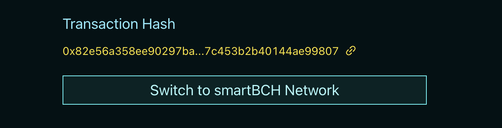

# 🌈 How to use


All Cross-Chain Tokens Address starts with 0xBC.


### Preparation

Since the bridge actually does not charge any fees, you will **NEED TO manually claim** assets on the other chain regardless of the direction of your cross-chain operation.

Therefore, you need to prepare some BNB as Gas fee.

Reference: [BNB Chain Official Website](https://www.bnbchain.org/en) , "Get BNB ".

In addition, if you have assets in BNB Chain and are ready to enter smartBCH, we offer convenient access to Gas exchange.

By simply checking "Need Gas", you will pay 0.01 BNB as a fee for cross-chain transactions and we will provide you with 0.01 BCH as a Gas fee in the smartBCH network at the same address.

### Cross-chain (DAI as an example)

First , select the from chain and the target chain, at this point take care to switch the Metamask wallet to the network of the from chain.

Then select the assets that will cross the chain.

Enter the quantity and click on SWAP, during which the APPROVE operation may be requested.

When the deposit operation is complete, you will be given a txid, which we recommend to save.

Then click on "Switch to Target Network".&#x20;

Click on "Claim" and you will receive the cross-chain version of the token.

### Manual Claim of Previous Transaction

If for some reason the claim is not successful, simply select the correct From and Target chains, switch the network to the Target chain, enter the TxID and click on "CLAIM" to complete the cross-chain process.
