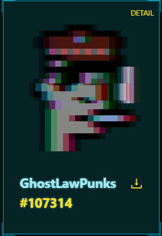

# 👻 MY GHOST

Displays your GhostLawPunks\*

\*GhostLawPunks - a NFT generated from liquidated punks via phantomization (see[#punkfi](my-token/lawpunk-details.md#punkfi "mention")).

GhostLawPunks are available to the public if a user defaults on their loan via phantomization&#x20;

<figure><figcaption></figcaption></figure>

