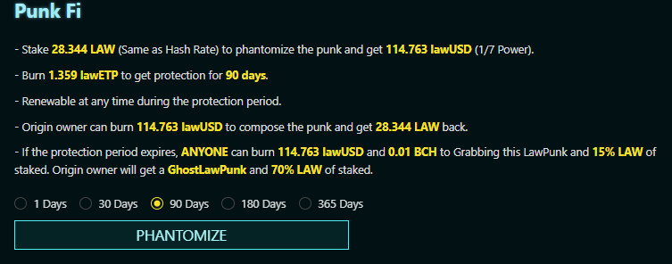

# LawPunk Details

## **LawPunks #xxxx - LawPunk ID**&#x20;

* Descripton of LawPunk below (i.e one of 226 Male Alien punks. )

**Accessories** - The traits of the LawPunk&#x20;

* Description of traits generated for this LawPunk (i.e Cap Forward , 85 punks have this.)

Metaverse Power - This calculation of "LawPunk Power" is determined by rarity , popularity , and leveling :

* Bloodline - Generated by the rarity score, and cannot be increased.
* Growth - The level of the punk (Can be increased by upgrading (100 per level).)
* Popularity - Can be increased by trading (10 per BCH or 1000 LAW) , settlement after the next LawPunk upgrade.
* Power - Bloodline + Growth + Popularity
* Hash Rate - Mining speed of this punk.


BlockNG provided document further detailing calculations and upgrade path for all LawPunks: [https://docs.google.com/spreadsheets/d/12SPhixm0zQsxeWAtJbUJsr9vlF6V\_YO\_ubXA8yBfyjA/edit?usp=sharing](https://docs.google.com/spreadsheets/d/12SPhixm0zQsxeWAtJbUJsr9vlF6V\_YO\_ubXA8yBfyjA/edit?usp=sharing)


## Skill

* Pharmacist - See [pharmacist.md](../../pharmacist.md "mention")
* Guru - See [guru.md](../../guru.md "mention")

## PunkFi

<figure><figcaption></figcaption></figure>

* PunkFi allows your punk to be "Phantomized" , paying the LawPunk owner to generate LawUSD from 1/7 LawPunk power.&#x20;
* LawETP is utilized as insurance coverage for the loan and must be maintained&#x20;
* Letting coverage expires allows other users to liquidate your position leaving borrower with GhostLawPunk&#x20;

## Current Market Status

#### Owner by address 0xxxxx : Current owner of LawPunk , clicking address will bring you to block explorer&#x20;

#### Sell - Listing is free! At the time of sale, the **5% BCH** / **3% lawUSD** / **1% LAW** will be deducted.

#### Bid - Allows non owner to place bid in either BCH , LawUSD, or LAW

#### Punk Manifesto - 10 law to display text until transfer or sale (All your punk's detail page will show this. )

#### Rallying Cry - Allows individual punk to make a statement (After transferring punk to another address, your message will no longer be shown.) See [cry.md](../../cry.md "mention")

### Transaction History

Transaction history will show the previous sales of the LawPunk including currency type, date and partial address of exchanging parties&#x20;

###

###
